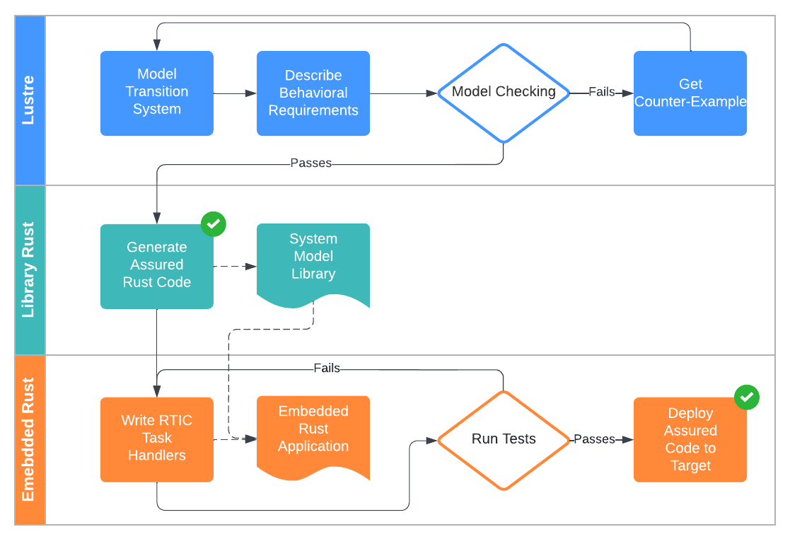

# Assured Embedded Rust 

This repo has 
* Notes on Assuring Cyber-Physical Systems Models and Implementing Their Software Components in Embedded Hardware. This is a space to develop my embedded programming workflows as I explore tooling and techniques.
* Example System Demonstrations. (EXPAND HERE...)
* A Lustre to Rust Compiler Prototype. This is based on the [compiler already in Kind2](https://kind.cs.uiowa.edu/kind2_user_doc/9_other/4_rust_compilation.html) with some necessary modifications. This prototype is suitable for
embedded environments as it generates a rust library without using the standard library (`no_std`). Also, this compiler generates Rust 2021 Edition.

## Development Overview

The developer starts by modeling their reactive, synchronous system in the Lustre programming language. Lustre is a synchronous dataflow language with a history of being used in critical systems, see [here](https://en.wikipedia.org/wiki/Lustre_(programming_language)). Requirements are then collected are translated to temporal properties and contracts. The Kind2 model checker [pulls these requirements](https://kind.cs.uiowa.edu/kind2_user_doc/home.html) as annotations in the Lustre code. The model checker can use proven invariants to output properties true for all inputs, as well as sequence counterexamples for all the properties that are falsified. 

Further, once verified, Kind2 compiles the Lustre program to a Rust library for use in embedded applications. For the assurance story, Rust ensures memory safety at compile time using the borrow checker as a ownership mechanism. 

Embedded Rust drivers need to be written to connect the dataflow model inputs/outputs/clocks to device peripheral I/O. The [Real-Time Interrupt-driven Concurrency (RTIC) Framework](https://rtic.rs/1/book/en/) provides a *data-race free* and *efficient* path to connect event triggering of device peripherals to the reactive inputs of the Rust system model. Once configured, the application is ready to be uploaded and run on an embedded target. 



*Development Pipeline*

## Installation
The embedded target used is the [STM32F407 Discovery board](https://www.st.com/en/evaluation-tools/stm32f4discovery.html). 

Requires (TODO: more detail here)
* Rust with Cargo
* OpenOCD
* GDB-Multiarch
* `thumbv7em-none-eabihf` Rust target and toolchain

For the Kind2, install OCaml and use dune to build. In `./kind2-embedded`,
```shell
# to build and install
dune build
dune install
```

The embedded rust can be generated via
```shell
kind2 <example.lus> --compile_no_std true
```
### Development
Setup OpenOCD and run
```shell
openocd -f interface/stlink-v2.cfg -f target/stm32f4x.cfg -l /tmp/openocd.log
```

To run with semihosting,
```shell
gdb-multiarch -q target/thumbv7em-none-eabihf/release/stm32f4-hello --command=.gdbinit
```
and run `c` to continue.

## Examples

(list of examples)

## Assurance Cases

### Model Checking

(the kind2 model checking stuff...)

### Data Race Free Concurrency 

(RTIC and locks)

### Memory Safety

(Rust memory safety)

## Lustre

(more detail of the language)

## Kind2

(more detail of the tool)

## RTIC 

(more detail of the framework)